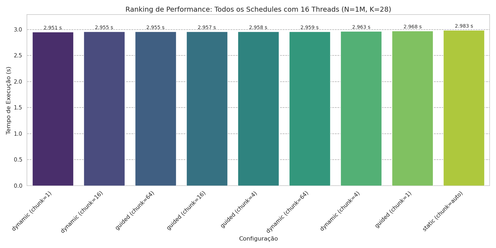
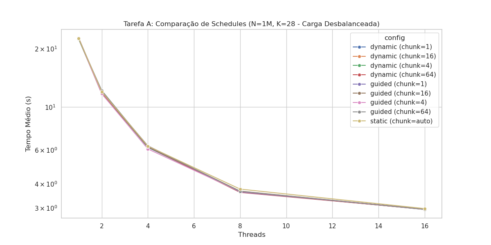
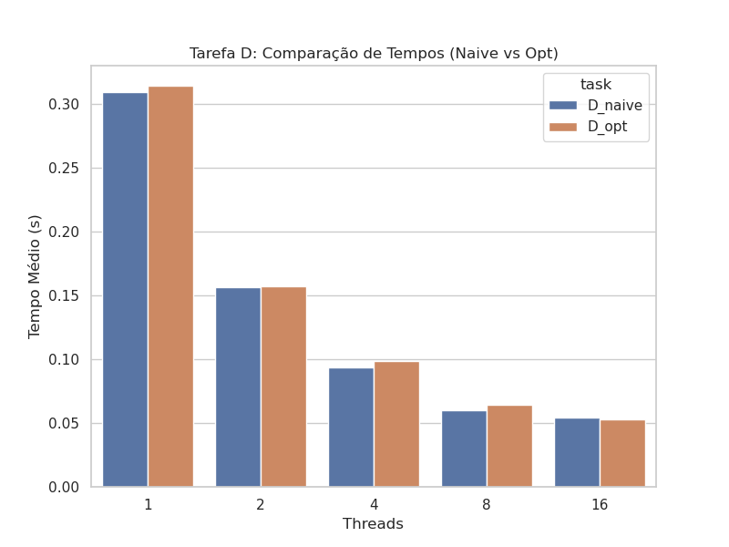
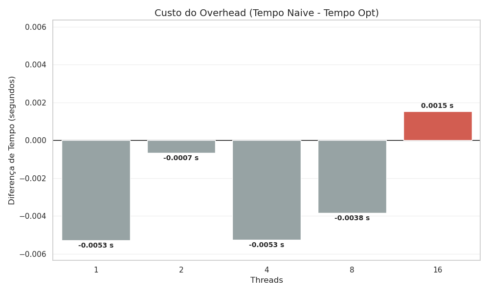

# TAREFA A

O kernel fib(i % 28) gera uma carga de trabalho extremamente irregular, onde algumas iterações são rápidas e outras extremamente custosas. Por esse motivo, é um cenário ideal para avaliar as políticas de escalonamento.

Static: Apresentou o pior resultado. Como a distribuição é fixa no início, threads que receberam lotes com mais números "pesados" demoraram muito mais, deixando as outras threads ociosas aguardando o término.

Dynamic:
- Chunks Pequenos (1 a 16): Obtiveram os melhores tempos. Embora buscar tarefas frequentemente na fila gere overhead, o custo computacional do Fibonacci é alto o suficiente para compensar isso, garantindo que ninguém fique parado.

- Chunks Grandes (64): O desempenho caiu devido ao desbalanceamento (e não overhead). Se uma thread pegar um bloco final de 64 iterações pesadas, ela trabalhará sozinha até o fim enquanto as outras ficam ociosas.

Guided:
- Com chunk=64, ele começou com blocos grandes (reduzindo overhead) e terminou com blocos de tamanho 64, evitando o "congestionamento" final.

- Já com chunk=1, embora eficiente, notou-se um leve overhead desnecessário no final da execução. À medida que as iterações finais são distribuídas uma a uma, aumenta-se a disputa pelo lock da fila de escalonamento, o que prejudicou seu desempenho.

Conclusão: Podemos concluir que o schedule(dynamic, 1) é a melhor escolha para este cenário de processamento pesado e irregular. O "peso" de cada tarefa é grande o suficiente para tornar o overhead de gerenciamento insignificante frente ao ganho de manter todas as threads ocupadas quase 100% do tempo.

# TAREFA D

Diferentemente da Tarefa A, quando o assunto são dados uniformes, a melhor escolha é utilizarmos o schedule(static). Como a operação consiste em somar vetores (carga de trabalho constante e previsível), espera-se melhor desempenho com a divisão estática padrão.

Após a análise dos dados da Tarefa D, notamos algo curioso: a princípio, imaginou-se que utilizar apenas uma região paralela (#pragma omp parallel) reduziria o custo computacional a ponto de superar a versão ingênua em todos os casos. No entanto, só obtivemos esse resultado claro com 16 threads. Antes disso (1 a 8 threads), o custo de criar dois parallel for acabou se compensando, pois o overhead de gerenciamento para poucas threads é desprezível para o sistema operacional. Além disso, a separação das regiões pode ter favorecido o uso da memória cache, permitindo que o processador focasse nos dados de um laço por vez, anulando o ganho da otimização proposta.
